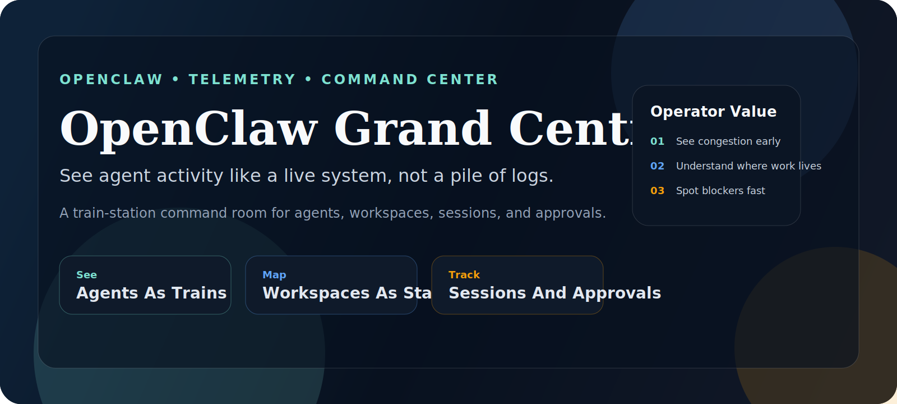
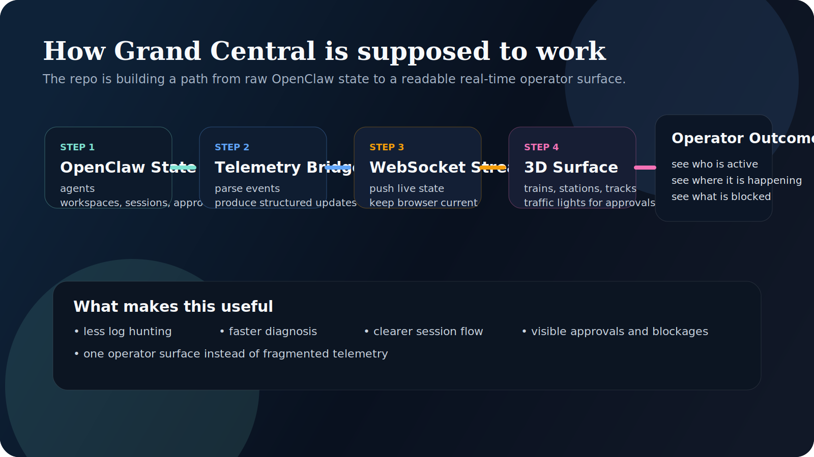

<p align="center">
  
</p>

# OpenClaw Grand Central

Real-time command center for OpenClaw.

The point is simple:

> stop treating agent activity like hidden logs and start seeing it like a live system.

This project is building a visual control room where OpenClaw agents move like trains, workspaces behave like stations, sessions flow like tracks, and exec approvals show up like traffic lights.

<p align="center">
  
  
  
  
</p>

## At A Glance

| Question | Answer |
| --- | --- |
| What is it? | A visual telemetry hub for OpenClaw |
| What does it show? | Agents, workspaces, sessions, lanes, and approvals |
| Why does it exist? | To make agent operations understandable in real time |
| What metaphor does it use? | Trains, stations, tracks, and traffic lights |
| What is the current state? | Architecture baseline plus frontend prototype |

## What This Project Is Trying To Become

OpenClaw already produces important operational signals:

- which agent is active
- which workspace it belongs to
- what lane or session it is running in
- whether an exec approval is pending
- whether the system is calm, congested, or blocked

The problem is that most of this lives in logs, terminal output, hooks, and scattered status surfaces.

Grand Central is meant to turn that into one visual place where you can immediately understand:

- what is happening
- where it is happening
- who is doing the work
- whether anything needs attention

## What Problem It Solves

Agent systems become hard to trust when they are invisible.

A complex OpenClaw deployment can have:

- multiple agents
- multiple workspaces
- multiple active sessions
- approvals waiting in the middle of execution
- event spam that is obvious in logs but hard to interpret fast

That creates a nasty operational gap:

- the system is active
- but the operator has poor situational awareness

Grand Central exists to close that gap.

## What The Interface Should Let You See Instantly

At a glance, the operator should be able to answer:

1. Which agents are currently active?
2. Which workspace is each agent attached to?
3. Which sessions are moving and which are stalled?
4. Are there approvals blocking progress?
5. Is the system healthy, congested, or failing?

If the interface cannot answer those questions fast, it is not doing its job.

## Why The Train Station Metaphor

The metaphor is not cosmetic.
It exists because OpenClaw behavior is easier to read when mapped to physical movement:

- **Agents** become trains
- **Workspaces** become stations
- **Sessions and lanes** become tracks
- **Exec approvals** become traffic lights
- **System flow** becomes visible motion instead of invisible state

That gives the operator something much more useful than another abstract dashboard:

it gives them a mental model.

## What The System Should Show

The intended experience includes:

- trains entering and leaving stations as agents become active or idle
- tracks lighting up as sessions move through execution
- traffic lights turning red or yellow when approvals are pending
- focused inspection when clicking a station or train
- right-click or context detail for agent prompt, model, and execution state

The goal is not just “pretty telemetry”.
The goal is operational clarity.

## What Exists Today

Right now this repository already contains:

- architecture baseline
- ADR structure
- maintenance and governance docs
- a frontend prototype in `web/index.html`
- CI for markdown and link quality
- repository scaffolding for stable collaboration

This means the repo is real, but early.

It is currently:

- a defined product direction
- a visual concept
- an architecture and governance foundation

It is not yet a full live production dashboard.

## What Still Needs To Be Built

The important next layers are:

- telemetry bridge from OpenClaw events to structured live updates
- real WebSocket streaming into the browser
- state model for trains, stations, tracks, and approvals
- proper 3D scene rendering
- filtering, focus, and level-of-detail controls
- operator interactions that open context instead of just showing decoration

## What “Good” Looks Like

If Grand Central is working correctly, the operator should feel this:

- less log-hunting
- faster diagnosis
- immediate visual awareness of congestion and blockages
- better trust in what the agent fleet is doing
- a clearer difference between “busy”, “healthy”, and “stuck”

## Core Architecture

The current architectural direction is:

1. **OpenClaw emits operational state**
2. **A telemetry bridge parses and structures it**
3. **A WebSocket layer pushes real-time updates**
4. **A browser client renders the state as a 3D command center**
5. **The operator interacts with live system state instead of raw logs**

This repo currently documents that direction in the architecture docs and starts expressing the visual side in the prototype.

<p align="center">
  
</p>

## Technical Direction

The architecture document currently recommends:

- **Frontend:** React + Vite
- **3D:** Three.js + React Three Fiber
- **State:** Zustand
- **Bridge:** Express + WebSocket server
- **Styling:** TailwindCSS for overlays and HUD

The current prototype is still much lighter than that final direction, which is fine.
The repo is still laying track before trying to run the trains.

## Why This Is More Than Another Dashboard

A normal dashboard tells you numbers.

Grand Central should tell you behavior.

That is the difference.

It should make it obvious when:

- an agent is moving smoothly
- a workspace is overloaded
- an approval is stopping the system
- a lane is jammed
- the whole environment is drifting into chaos

That is why the visual metaphor matters.

## Quick Start

Open the current prototype locally:

```bash
cd /home/escalona/.openclaw/workspace-omnia/openclaw-grand-central
xdg-open web/index.html
```

## Repository Layout

```text
.
├── docs/
│   ├── ARCHITECTURE_OPENCLAW_STATION.md
│   ├── MAINTENANCE.md
│   └── adr/
├── web/
│   └── index.html
├── .github/
│   ├── ISSUE_TEMPLATE/
│   └── workflows/
├── CHANGELOG.md
├── CONTRIBUTING.md
├── SECURITY.md
└── README.md
```

## Current Working Model

The repository is intentionally being built in this order:

1. define architecture first
2. record major decisions as ADRs
3. keep the prototype honest to the architecture
4. grow the implementation in small reviewable slices

That discipline matters because this kind of project can turn into visual nonsense very fast if the telemetry model is weak.

## Project Philosophy

This repo is not trying to be a random “3D AI dashboard”.

It is trying to become a serious operator surface for OpenClaw.

That means:

- clarity beats gimmicks
- live state beats screenshots
- behavior beats decoration
- architecture comes before spectacle

## License

MIT - see [LICENSE](LICENSE).
